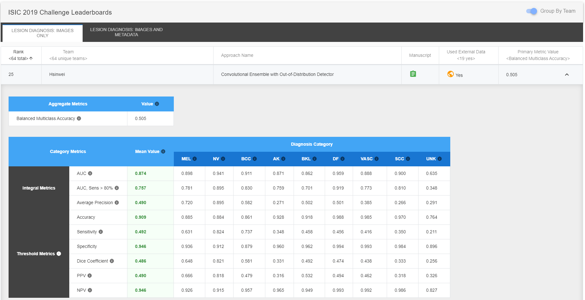

# ISIC 2019 - Skin Lesion Analysis Towards Melanoma Detection

This is a [Keras](https://keras.io) with [TensorFlow](https://www.tensorflow.org/) backend implementation for [ISIC 2019 Challenge](https://challenge2019.isic-archive.com) Task 1: classify dermoscopic images among nine different diagnostic categories without meta-data. The proposed approaches implemented in this repository were ranked 25<sup>th</sup> out of 64 unique teams with Balanced Multiclass Accuracy of 0.505 (0.636 for the first team). The [ODIN (Out-of-DIstribution detector for Neural networks)](https://github.com/facebookresearch/odin) method used in the first approach was re-implemented using Keras. This is also my capstone project of [Udacity Machine Learning Nanodegree](https://www.udacity.com/course/machine-learning-engineer-nanodegree--nd009t). For more details please refer to the [project report](docs/capstone_project_report.pdf).

## Getting Started

### Dependencies

* Python 3.5 or above
* Keras 2.2.4
* TensorFlow 1.14
* [pandas](https://pandas.pydata.org)
* [NumPy](https://www.numpy.org)
* [Matplotlib](https://matplotlib.org)
* [scikit-learn](https://scikit-learn.org)
* [OpenCV-Python](https://github.com/skvark/opencv-python)
* [tqdm](https://github.com/tqdm/tqdm)
* [Augmentor](https://github.com/mdbloice/Augmentor): A modification of Augmentor 0.2.3 is under [Augmentor](Augmentor/)
* [Pillow-SIMD](https://github.com/uploadcare/pillow-simd) and [libjpeg-turbo](https://libjpeg-turbo.org): Not necessary but recommend using them to improve image processing performance. I followed the fastai's [document](https://docs.fast.ai/performance.html#installation) to install them.

### Datasets

* [ISIC 2019 Training/Test Data](https://challenge2019.isic-archive.com/data.html)
* [ISIC Archive](https://www.isic-archive.com/#!/topWithHeader/onlyHeaderTop/gallery)

| Diagnostic Category                | Amount |
| ---------------------------------- | ------ |
| Angiofibroma or fibrous papule     | 1      |
| Angioma                            | 12     |
| Atypical melanocytic proliferation | 12     |
| Lentigo NOS                        | 70     |
| Lentigo simplex                    | 22     |
| Scar                               | 1      |

* [Seven-Point Checklist Dermatology Dataset](http://derm.cs.sfu.ca/) ([Github](https://github.com/jeremykawahara/derm7pt))

After downloading the dataset, all melanosis images can be retrieved from the dataset by using the [notebook](derm7pt.ipynb).

| Diagnostic Category | Amount |
| ------------------- | ------ |
| Melanosis           | 16     |

### Directory & File Structure of Input Data

* Put all data under a root folder like the tree structure shown below.
  * **ISIC_2019_Training_Input** and **ISIC_2019_Test_Input** folders contain images of ISIC 2019 Training Data and Test Data respectively.
  * **Out_Distribution** folder contains all out-of-distribution images from both ISIC Archive and Seven-Point datasets.
  * **ISIC_2019_Training_GroundTruth_DuplicateRemoved.csv** is a copy of ISIC_2019_Training_GroundTruth.csv but removing two entries: ISIC_0067980 and ISIC_0069013.
```
RootFolder
│   ISIC_2019_Training_GroundTruth.csv
│   ISIC_2019_Training_GroundTruth_DuplicateRemoved.csv
│
└───ISIC_2019_Test_Input
│   │   ISIC_0034321.jpg
│   │   ISIC_0034322.jpg
│   │   ...
│   │
└───ISIC_2019_Training_Input
│   │   ISIC_0000000.jpg
│   │   ISIC_0000001.jpg
│   │   ...
│   │
└───Out_Distribution
│   │   7pt_Fgl059.jpg
│   │   7pt_Fhl002.jpg
│   │   ...
│   │   ISIC_0001115.jpg
│   │   ISIC_0001129.jpg
│   │   ...
```

## Training and Predicting

Follow the steps starting from the **Common Parameters** cell in the notebook [approach_1.ipynb](approach_1.ipynb) and [approach_2.ipynb](approach_2.ipynb) to reproduce training and predicting processes of approach-1 and 2 respectively. You might need to change a few parameters according to the environment.

### Command-line

Here is an example code of training [DenseNet201](https://keras.io/applications/#densenet), [Xception](https://keras.io/applications/#xception) and [ResNeXt50](https://keras.io/applications/#resnet) models using approach-1. Assuming the path to the data root folder is `/home`.
```
python3 main.py /home --approach 1 --training --epoch 100 --batchsize 32 --maxqueuesize 10 --model DenseNet201 Xception ResNeXt50
```

Use `-h` to show usage messages.
```
python3 main.py -h
```

## Testing Results

Please visit [ISIC 2019 Challenge Leaderboards](https://challenge2019.isic-archive.com/leaderboard.html) for complete rankings.

**Team Rankings**

Ranked 25<sup>th</sup> out of 64 unique teams with Balanced Multiclass Accuracy of 0.505 (0.636 for the first team)


**Approach Rankings**

| Rank | Approach Name (129 approaches)                                             | Balanced Multiclass Accuracy |
| ---- | -------------------------------------------------------------------------- | ---------------------------- |
| 52   | Convolutional Ensemble with Out-of-Distribution Detector                   | 0.505                        |
| 57   | Skin Lesion Classification using Ensemble of Convolutional Neural Networks | 0.499                        |

## License

[MIT](LICENSE)
